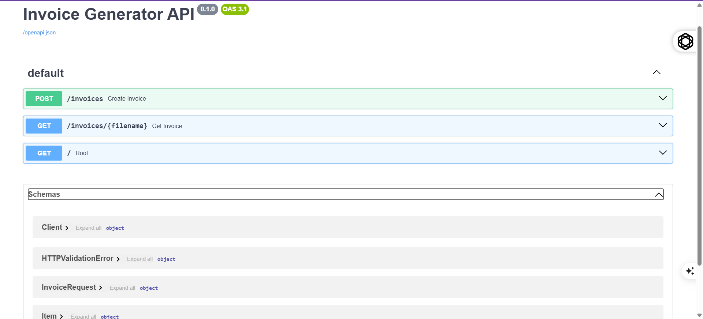

# 🧾 Invoice Generator API

A FastAPI‑based backend service that generates professional PDF invoices on demand.  
Built with Python, FastAPI, and ReportLab, this project demonstrates clean API design, PDF generation, and recruiter‑ready documentation.

---

## ✨ Features
- Generate PDF invoices with customer details and line items
- Retrieve invoices by filename
- Automatic timestamped filenames (no overwrites)
- Interactive API documentation with Swagger UI
- Recruiter‑ready README with screenshots and sample output

---

## 🛠 Tech Stack
- **Backend**: Python, FastAPI
- **PDF Generation**: ReportLab
- **Database**: (optional, file‑based storage for now)
- **Docs**: Swagger UI (auto‑generated)

---

## 🌐 API Root & Documentation
- **API root**: [http://127.0.0.1:8000](http://127.0.0.1:8000)  
- **Swagger docs**: [http://127.0.0.1:8000/docs](http://127.0.0.1:8000/docs)

---

## 📖 API Endpoints

### Swagger Overview
The API is fully documented with Swagger UI.



---

### POST /invoices
Create a new invoice by sending customer details and line items.

**Request Body**
```json
{
  "client_name": "John Doe",
  "client_email": "john@example.com",
  "items": [
    { "item": "Web Development Services", "qty": 10, "price": 50 },
    { "item": "Hosting (1 year)", "qty": 1, "price": 120 }
  ],
  "currency": "USD"
}
Responses

200 OK → Returns the generated invoice filename and URL

422 Validation Error → Missing or invalid fields

  

GET /invoices/{filename}
Retrieve a previously generated invoice by filename.

Request

Http


Copy
GET /invoices/invoice_20250928_191340.pdf

Response

Json


Copy
{
  "filename": "invoice_20250928_191340.pdf",
  "url": "http://127.0.0.1:8000/invoices/invoice_20250928_191340.pdf"
}

Sample Invoice
Here’s an example of the generated PDF invoice:


🚀 Setup & Run
Clone the repository:

Bash


Copy
git clone https://github.com/yourusername/invoice-generator-api.git
cd invoice-generator-api
Create a virtual environment & install dependencies:

Bash


Copy
python -m venv venv
source venv/bin/activate   # On Windows: venv\Scripts\activate
pip install -r requirements.txt
Run the server:

Bash


Copy
uvicorn main:app --reload
Open Swagger docs at:

Code


Copy
http://127.0.0.1:8000/docs
📌 Notes
Invoices are saved with timestamped filenames (e.g., invoice_20250928_191340.pdf)

Screenshots in this README are based on the same sample request/response flow

Extendable with authentication, Stripe billing, or database storage

